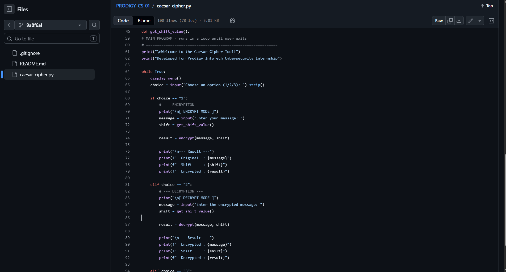
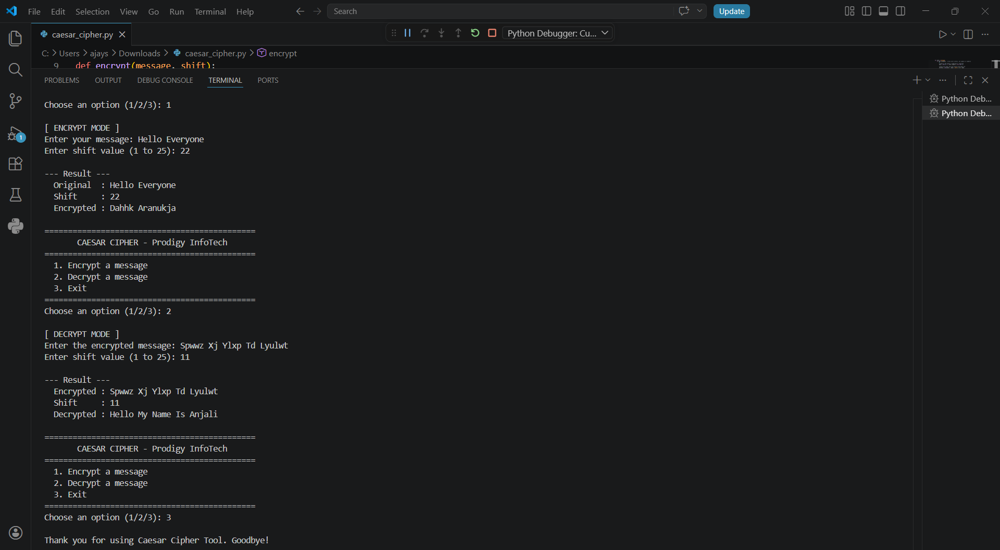

# PRODIGY_CS_01 — Caesar Cipher

> 🔐 Task 1 | Prodigy InfoTech Cybersecurity Internship

---

## 📌 What is Caesar Cipher?

The Caesar Cipher is one of the **oldest and simplest encryption techniques** in history, used by Julius Caesar to send secret messages. It works by **shifting each letter** in a message by a fixed number of positions along the alphabet.

**Example with shift = 4:**

```
Plain text : Meet me at 5 pm
Encrypted  : Qiix qi ex 5 tq
```

To **decrypt**, you simply shift the letters back by the same number.

---

## 🛠️ Features

* ✅ Encrypt any text message
* ✅ Decrypt any Caesar-encrypted message
* ✅ Handles both **uppercase and lowercase** letters
* ✅ Keeps **spaces, numbers, and symbols** unchanged
* ✅ Input validation for shift values
* ✅ Clean menu-driven interface

---

## 🚀 How to Run

Make sure you have **Python 3** installed.

```bash
python caesar_cipher.py
```

---

## 💻 Example Runs

### Example 1 — Encrypting a sentence

```
Choose an option: 1
Enter your message: Cybersecurity is important
Enter shift value: 4

Original  : Cybersecurity is important
Shift     : 4
Encrypted : Gcfivwigyvmxc mw mqtvsverx
```

### Example 2 — Decrypting a message

```
Choose an option: 2
Enter the encrypted message: Gkrru, oY hkru!
Enter shift value: 6

Encrypted : Gkrru, oY hkru!
Shift     : 6
Decrypted : Allow, iS bers!
```

### Example 3 — Encrypting with shift 13 (ROT13)

```
Choose an option: 1
Enter your message: Keep this message secret
Enter shift value: 13

Original  : Keep this message secret
Shift     : 13
Encrypted : Xrrc guvf zrffntr frperg
```

---

## 📸 Screenshots

### 💻 Code



### ▶️ Output



---

## 📁 File Structure

```
PRODIGY_CS_01/
│
├── caesar_cipher.py
└── README.md
```

---

## 🧠 How it Works (Simple Explanation)

Every letter has a number (A=0, B=1, C=2 ... Z=25).

To **encrypt**:
`new_position = (original_position + shift) % 26`

To **decrypt**:
`original_position = (encrypted_position - shift) % 26`

The `% 26` ensures the letters wrap around (so Z + 1 becomes A).

---

## ⚠️ Limitations

The Caesar Cipher is not secure for modern use, as it can be easily broken using brute-force attacks.

---

## 👨‍💻 Author

**Anjali Kunwar Simari**
Cybersecurity Intern @ Prodigy InfoTech

---

## 🔑 Keywords

* Cybersecurity
* Python
* Encryption
* Caesar Cipher
